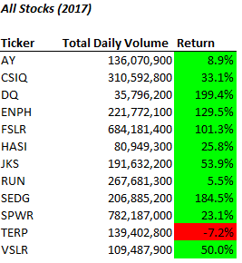
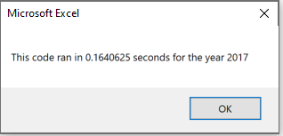
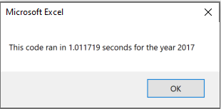
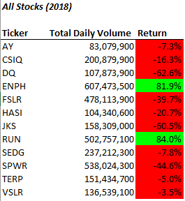
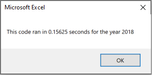
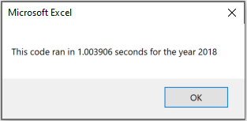

# Wall Street Stocks Analysis (using VBA)
---
## Overview of Project

In order to assist Steve and his parents determine if certain stocks are performing well, 
this analysis aims to sift through data and return a summary fairly quickly while being easily readable. 
In the summary, the analysis should reflect a stock's total daily volume and the yearly return for each stock.  

### Purpose

While it's possible to manually go through each row of data and determine how well a stock performed for that day and 
track its performance incrementally through the year, that task would require a lot of bandwith and time.
As an analyst, it's a daunting and tedious task. Hence, using VBA speeds up this process and autogenerates the results within seconds.
The purpose of this week's challenge was to generate a code that can return a stock ticker's total daily volume as well as its return.
**"Total Daily Volume"** can be defined as *the total number of shares it is traded throughout the day*, which in essence measures how
often the task is actively traded. In addition, the **"Return"** reflects the *percentage difference in price from the begininning of
the year to the end of the year.*

## Analysis/Results
---

### The Ask
In the deliverable, a code was already partially written & the task was to complete the code
in order to loop through the data one time and collect all of the information. 

  

    Provided Code
  

    Sub AllStocksAnalysisRefactored()
    
    Dim startTime As Single
    Dim endTime  As Single
    
    yearValue = InputBox("What year would you like to run the analysis on?")

    startTime = Timer
    
    'Format the output sheet on All Stocks Analysis worksheet
    Worksheets("All Stocks Analysis").Activate
    
    Range("A1").Value = "All Stocks (" + yearValue + ")"
    
    'Create a header row
    Cells(3, 1).Value = "Ticker"
    Cells(3, 2).Value = "Total Daily Volume"
    Cells(3, 3).Value = "Return"

    'Initialize array of all tickers
    Dim tickers(12) As String
    
    tickers(0) = "AY"
    tickers(1) = "CSIQ"
    tickers(2) = "DQ"
    tickers(3) = "ENPH"
    tickers(4) = "FSLR"
    tickers(5) = "HASI"
    tickers(6) = "JKS"
    tickers(7) = "RUN"
    tickers(8) = "SEDG"
    tickers(9) = "SPWR"
    tickers(10) = "TERP"
    tickers(11) = "VSLR"
    
    'Activate data worksheet
    Worksheets(yearValue).Activate
    
    'Get the number of rows to loop over
    RowCount = Cells(Rows.Count, "A").End(xlUp).Row
    
    '1a) Create a ticker Index
    

    '1b) Create three output arrays   
    
    
    ''2a) Create a for loop to initialize the tickerVolumes to zero. 
    
        
    ''2b) Loop over all the rows in the spreadsheet. 
    For i = 2 To RowCount
    
        '3a) Increase volume for current ticker
        
        
        '3b) Check if the current row is the first row with the selected tickerIndex.
        'If  Then
            
            
            
        'End If
        
        '3c) check if the current row is the last row with the selected ticker
         'If the next row’s ticker doesn’t match, increase the tickerIndex.
        'If  Then
            
            

            '3d Increase the tickerIndex. 
            
            
        'End If
    
    Next i
    
    '4) Loop through your arrays to output the Ticker, Total Daily Volume, and Return.
    For i = 0 To 11
        
        Worksheets("All Stocks Analysis").Activate
        
        
    Next i
    
    'Formatting
    Worksheets("All Stocks Analysis").Activate
    Range("A3:C3").Font.FontStyle = "Bold"
    Range("A3:C3").Borders(xlEdgeBottom).LineStyle = xlContinuous
    Range("B4:B15").NumberFormat = "#,##0"
    Range("C4:C15").NumberFormat = "0.0%"
    Columns("B").AutoFit

    dataRowStart = 4
    dataRowEnd = 15

    For i = dataRowStart To dataRowEnd
        
        If Cells(i, 3) > 0 Then
            
            Cells(i, 3).Interior.Color = vbGreen
            
        Else
        
            Cells(i, 3).Interior.Color = vbRed
            
        End If
        
    Next i
 
    endTime = Timer
    MsgBox "This code ran in " & (endTime - startTime) & " seconds for the year " & (yearValue)
    
    End Sub

In the code, a `tickerIndex` was created for the purpose of looping the data
through each ticker/each row to find and calculate outputs related to the two variables.
In essence, the code is written to check if the current row matches the given
ticker, it increases the volume for that ticker. In addition, the range is based on a starting
and ending price. The code is written to check if the current row ticker matches the row before; if true, 
it picks up the value in the "Close" column of the data. It also checks to see if the current row ticker matches the next row.
If true, it picks up the value in column 6 again. If false, it tells the code to increase the `tickerIndex` and look at the next ticker/stock.
It runs the code until it reaches the total amount of rows accounted. In the output, it should show a value (for every ticker noted)
in Total Volumes and a calculated value of starting/ending prices in Returns.

  

    Added Codes
  

      
        '1. Index
        tickerIndex = 0
        
        '2. Loops for initializing the volumes to zero
        For i = 0 to 11
        tickerVolumes(tickerIndex) = 0
        Next i
        
        '3. Loops the rows for the tickerIndex
         For i = 2 To RowCount     
                    tickerVolumes(tickerIndex) = tickerVolumes(tickerIndex) + Cells(i, 8).Value
                    If Cells(i - 1, 1).Value <> tickers(tickerIndex) And Cells(i, 1).Value = tickers(tickerIndex) Then
                    tickerStartingPrices(tickerIndex) = Cells(i, 6).Value
                    End If
                    If Cells(i + 1, 1).Value <> tickers(tickerIndex) And Cells(i, 1).Value = tickers(tickerIndex) Then
                    tickerEndingPrices(tickerIndex) = Cells(i, 6).Value
                    tickerIndex = tickerIndex + 1
                    End If
                    
          Next i
           

### Results
Within the deliverable, it runs the code based on the selected year.
There are two different years available and the results reflect accordingly.

**YEAR 2017** 
After running the macro, it generates the following analysis: 
>

Based on the embedded timer, it took the macro to run this long: 
*Refactored Version* 
>

In this week's module, we built a similar code that involves a nested loop. Within the nested loop, it produces the same outcome.
However, in the module, it tells the code to look at one stock and run each step. Then once it's done running all the steps for one
stock, it loops back and starts the process again for the next loop.
As part of the challenge, the intent was to refactor the code to make it run faster.
In the refactored code, it's meant to loop through all the data one time. Hence, the nested looping is no longer occuring.

Comparing the rates, we can see from the following timer how long it took to run the first time with the nested looping. 
*Original Version* 
>

We can see the time difference between the two codes was shortened by 0.8476565 seconds as a result of refactoring. Resultantly, the refactored code ran a lot faster.
  
  

**YEAR 2018** 
Similarly, we ran the same analysis; but this time, we ran it for the 2018 year. 
The following chart reflects how well each stock was performing for this specified year: 
>

Comparing the rates of macro run times, we see a similar pattern like 2017.  The refactored macro is running faster by 0.988281 seconds.

*Refactored Version* 
>

*Original Version* 
>

### Observations
Overall, between the two years, it's safe to say trading in 2017 went well and the returns looked very promising.
2018 painted a different story. It seems the rate return of all the stocks (except for "ENPH" and "RUN") didn't do so well.
Most of the returns dropped significantly year over year (YOY). However, "RUN" is doing very well in both years and see a dramatic increase in 2018.

## Summary
---
*What are the advantages/disadvantages of refactoring code in general?*

* **Advantages:** Clearly, by the run times, refactoring code generates results faster. In addition, these faster results make happy clients, like Steve, knowing
they get answers to their questions quickly. Another pro related to refactoring is its flexibility in code; it's easier to go back to the code and extend it for any additional variables. For example, with this analysis, it's easier to go back and add a new stock ticker in one place without having to rewrite additional code elsewhere in the script. Thus, refactoring should make it easier to maintain over time. There is also less room for errors when there's less code to update/maintain.

* **Disadvantages:** While refactoring code is easier to maintain, writing a refactored code is more thought-provoking, especially if you are refactoring a code that has already been written. It seems that there is more room for error when actually building a code because there are chances that you are not capturing every code/variable that needs to be referenced. Refactoring is an advanced form of writing code in which it becomes a reference of a reference. Hence, without careful thought, it's easy to miss adding an index or a variable. I often found myself having to check if this reference is correctly referencing its previous reference. In addition, reading a refactored code isn't as simple as it seems. If you're not familiar with the code, it is very easy to get lost in translation. 

*What are the advantages/disadvantages of the original and refactored VBA script?*
* **Advantages:** In this week's module, it was definitely a lot easier to write the original(non-refactored) code. It was straigtforward in writing and reading the code. Nested looping seemed difficult to understand, but writing the nested loops were easier than I thought. It was easier to follow along in what the code was trying to accomplish. The refactored script also had its pros in that it did run faster. In addition, we were fortunate enough to have our data sorted and grouped, making both the codes (original or refactored) seamless in running. However, I believe that refactoring would be advantageous if the data was in no particular order. In essence, the refactored code is a catch-all and looks at the data all at once versus the original script.

* **Disadvantages:** In writing the refactored code and having to build from the original script, it took a lot longer to understand what refactoring actually meant. Writing the refactored code was time-consuming and a lot of the writing came with trial and error. I found myself running into multiple errors and having to debug often. Other times, I found some code missing and some code not correctly being referenced. Most of my time was spenting understanding what the code was trying to do; however, I do think that falls partially on the unclear directions of the challenge. In addition, I found it difficult to shift from the original script to the VBA refactored code. Writing that first code, the mind is fixated on the script to run a certain way and I imagined the refactored to be written similarly. However, it wasn't until fully understanding the ask and knowing the nested loop had to be removed in the refactored code made all the difference in the world. 
